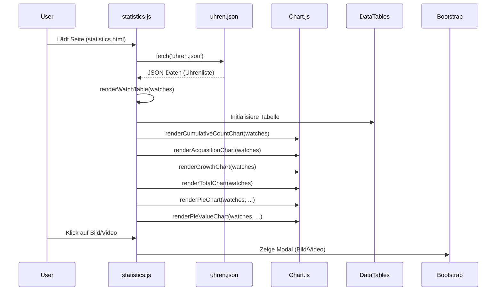

# ChronoFolio Uhren Statistik-Dashboard

## Funktionalität

Dieses Modul bietet ein Statistik-Dashboard für die Uhren-Sammlung. Es lädt die Daten aus `uhren.json` und visualisiert sie in verschiedenen Diagrammen und Tabellen. Die wichtigsten Funktionen sind:

- Anzeige einer Tabelle aller Uhren mit Bildern, Preisen, Hersteller, Typ, Kaufdatum, Video-Links und Bemerkungen.
- Interaktive Diagramme (Chart.js) für:
  - Wertzuwachs pro Monat
  - Kumulativer Gesamtwert
  - Neuzugänge pro Monat
  - Kumulative Anzahl der Uhren
  - Uhren pro Marke/Typ (horizontal Bar statt Pie)
  - Wert nach Marke/Typ
- Modal-Logik für Bild- und Videoanzeige (Bootstrap)
- Responsive Darstellung und DataTable-Integration mit Sortierung, Suche und Summenberechnung

## Tech Stack

- **Chart.js**: Für alle Diagramme und Visualisierungen
- **Luxon**: Für Datumsverarbeitung und Gruppierung nach Monat/Jahr
- **jQuery**: DOM-Manipulation und Event-Handling
- **DataTables**: Erweiterte Tabellenfunktionen (Sortierung, Suche, Summen)
- **Bootstrap**: Modale Fenster für Bild- und Videoanzeige, Responsive Design

## Sequenzdiagramm: statistics.js

## Verbesserungsvorschläge

- **Code-Struktur**: Methoden könnten in ein Modul/ES6-Klasse ausgelagert werden, um globale Variablen zu vermeiden.
- **Fehlerbehandlung**: Mehr Fehlerbehandlung bei fehlenden oder fehlerhaften Daten (z.B. ungültige Kaufdaten, fehlende Felder).
- **Testbarkeit**: Trennung von Logik und DOM-Manipulation für bessere Testbarkeit.
- **Performance**: Caching von berechneten Werten, um wiederholte Berechnungen bei großen Datenmengen zu vermeiden.
- **Barrierefreiheit**: Verbesserte ARIA-Attribute und Tastatursteuerung für Modal und Tabelle.
- **Internationalisierung**: Unterstützung für weitere Sprachen und Währungen.
- **Konfiguration**: Auslagerung von Chart-Optionen und Farben in eine zentrale Konfigurationsdatei.
- **Unit-Tests**: Einführung von Unit-Tests für die wichtigsten Funktionen.
